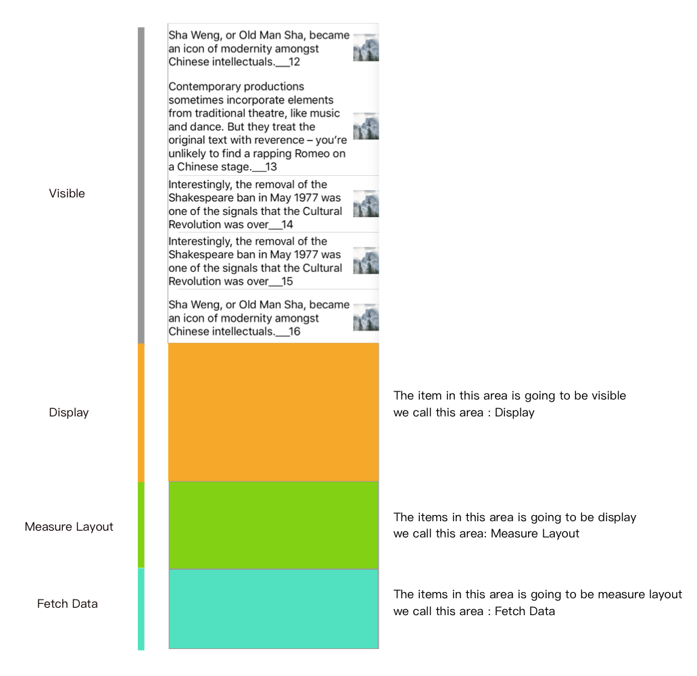

# VDRangeController

一般来说tableView 的可见配置区域如下图中Visible 就是tableView 的visibleIndexPaths,当需要提在cell 变为可见之前，对view 做一些配置的话。VDRangeController come to rescue you !

> * Display : 这个区域的Views将要变为Visible,可以提前做一些UI的配置，layout等。
> * MeausreLayout: 这个区域的Views将要变为Display，可以提前做一些view的高度就算，e.g 字符串的高度计算。
> * Fetch Data: 这个区域的Views将要变为MeasureLayout,可以提前做一些数据的拉取，e.g 本读数据库的数据读取等

//TODO: 9点了，今晚继续写，上班了。